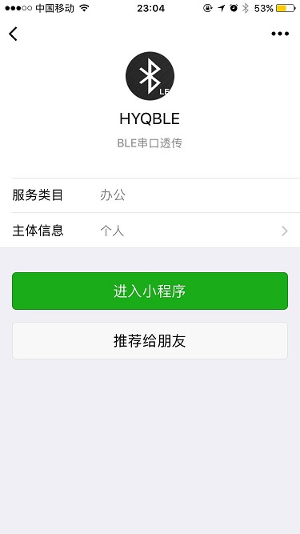
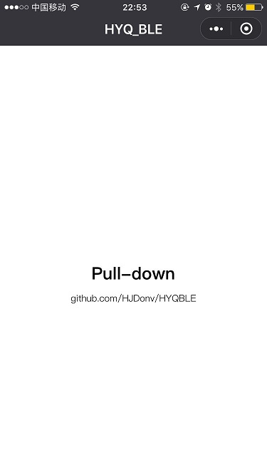
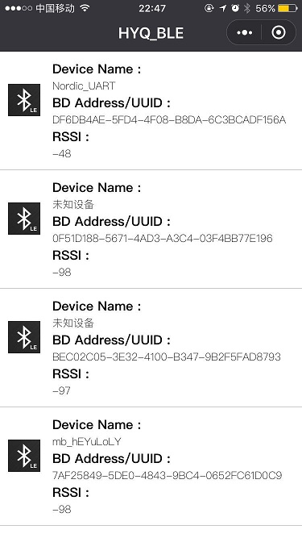
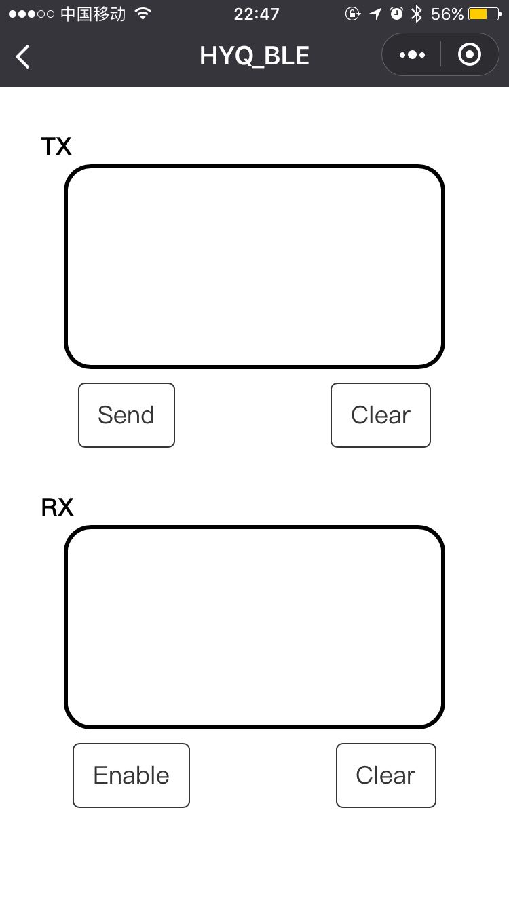

# HYQ_BLE

最近有机会接触到微信小程序，学习了一下Web语言，现学现卖做了一个串口透传Demo，以后应该不会维护和更新。该工程许多地方借鉴了前辈的经验，链接如下：https://github.com/lixiantai/BLE_MiniProgram

实测：

1. nordic的nus例程直接用
2. NXP的qpps例程直接用
3. 理论只要只有一个自定义service，一个notify特征值，一个write without response特征值，都可以用。

演示体验：

打开微信小程序，搜索“HYQBLE”

下拉触发扫描动作

连接扫描到的设备

进行透传测试

